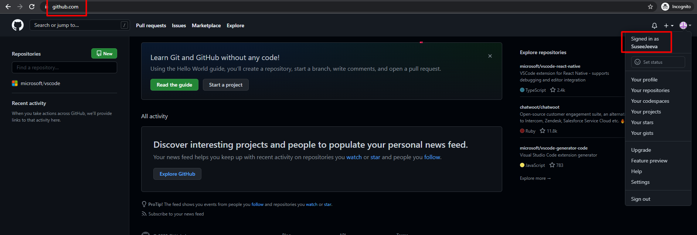
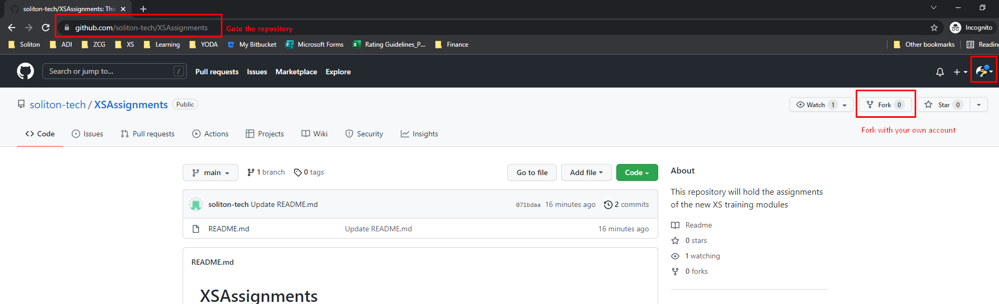
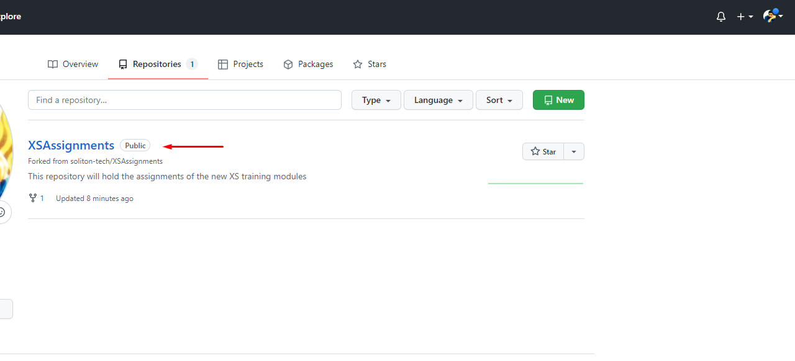
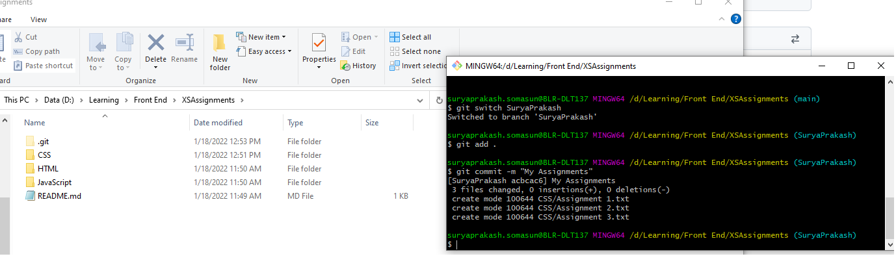
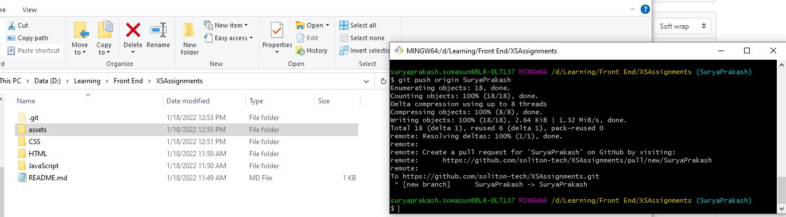
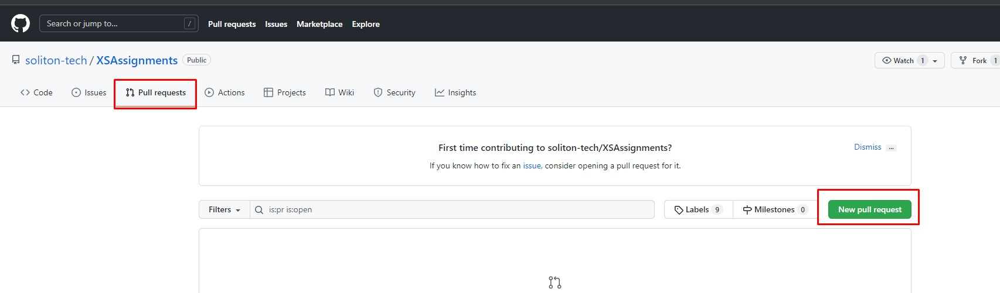
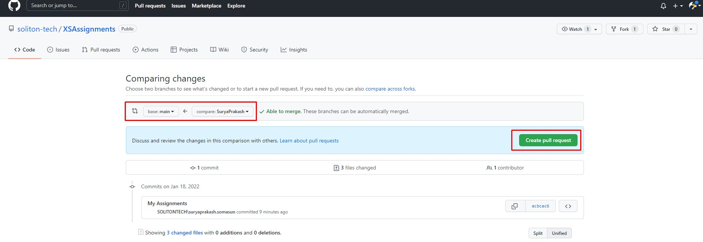

# XSAssignments
This repository will hold the assignments of the new XS training modules

1. Create your own github account
	
2. Fork the repository - https://github.com/soliton-tech/XSAssignments.git
	
3. The repository is forked to your github account
	
4. Clone the repository from your account - git clone https://github.com/<**_your repo name_**>/XSAssignments.git
5. Create a branch with your name. (Eg., SuryaPrakash)
6. Copy the assignment files (each folder for each assignment)
7. Commit the changes
	
8. Push the changes. 
	
   If you get a prompt to enter the credentials:
	   Username - your github account's username
	   Password - your github account's password
   
9. Open the GitHub from the browser and Raise PR to the master branch
	
	
